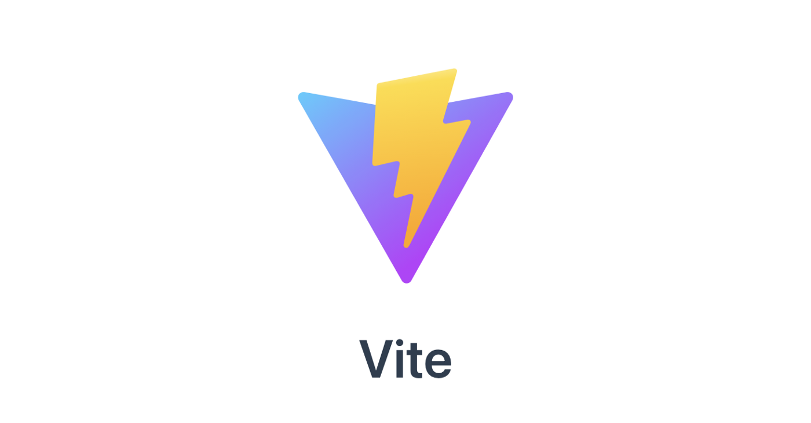

# Vite を活用した静的サイトテンプレート

## 目次

- [インクルードの代替](#include)

<h2 id="include">インクルードの代替</h2>

**components ディレクトリ**の中に **parts.html** を作る。
読み込みたい箇所に **{{> parts}}**

## jQuery

使いたいファイルの先頭に　**import $ from "jquery";**

## 下層ページの作り方

src の中にディレクトリーを作ることで構成できる。

## 外部ファイルの読み込み

- 普段通り html ファイルに記述できる。
- カレントファイルから見た相対パスで記述するとビルド後に相対パスでリンクされる。
- script タグは **type="module"** を付ける
- html 中で .scss .ts の読み込みもできる
- scripts ディレクトリの中身は js でも ts でも可能

## 共通ナビ等のリンク

普段通り href 属性にルートパスで記述できる。

## 制作ディレクトリ

src ディレクトリ内で制作する
dist ディレクトリ内は触らない

## IP で接続したい場合

1. ( .env )ファイルの作成。
2. NETWORK_IP=IP アドレスを入力する　(npm run dev したときの Network に出てくる)

デフォルトではローカルホストにつながるようにしています。

### npm(gsap や swiper の使い方)

1. パッケージのインストール。ターミナルで **npm i gsap**
2. 使用したい js ファイルの先頭に**import gsap from "gsap"**。

## npm script

- npm start（IP で接続（スマホなど色々な端末で確認できる））
- npm run dev （上記同様）
- npm run build （ビルド）
- npm run preview （本番プレビュー（build してからじゃないと更新されない））
- npm run prod （build - preview （ショートカット））
